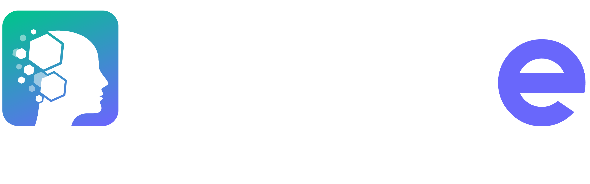

# 

The objective of the joint laboratory project **LAMAe** is to develop knowledge in the field of Autonomous and Empathic Multimodal Agents.

An "autonomous digital human" refers to a virtual representation of an individual, used in various digital contexts such as virtual reality, video games, communication applications, etc. This representation can take the form of an avatar, a virtual assistant, or an interactive character. The company DAVI, a long-time partner of the project leader and engaged in this joint laboratory proposal, is a major player in the market of emotional conversational agents. Their agents have the ability to interact with users empathetically, making interactions close to human interactions.

We aim to create digital humans capable of interacting naturally with users to improve the long-term interaction experience by integrating the relational dimension, as opposed to chatbots developed only to answer questions. We aim to develop agents with the ability to perform complex task sequences in a variety of fields, answer business questions, train, and also keep their business knowledge up to date, while adopting proactive behavior. The focus would be on designing advanced algorithms for natural language processing and computer vision to create personalized and immersive interactions.

This repo includes a list of papers on agentic and empathic AI.

---

L'objectif du projet de Laboratoire commun **LAMAe** est de développer des savoirs dans le domaine des Agents Multimodaux Autonomes et Empathiques.

Un "humain digital autonome" désigne une représentation virtuelle d'un individu, utilisée dans divers contextes numériques tels que la réalité virtuelle, les jeux vidéo, les applications de communication, etc. Cette représentation peut prendre la forme d'un avatar, d'un assistant virtuel ou d'un personnage interactif. L’entreprise DAVI partenaire de longue date du porteur de projet et engagé dans cette proposition de laboratoire commun est un acteur majeur sur le marché des agents conversationnels émotionnels. Leurs agents ont la capacité d’interagir avec les utilisateurs en faisant preuve d’empathie rendant les interactions proches des interactions humaines.

Nous visons la réalisation d’humains digitaux capables d'interagir de manière naturelle avec les utilisateurs pour améliorer l'expérience d’interaction sur le long cours en intégrant la dimension relationnelle, à contrario des chatbots développés seulement pour répondre aux questions. Nous visons le développement d’agents avec des capacités de réalisation de séquences de tâches complexes dans une variété de domaines, de répondre à des questions métiers, de former, mais aussi de maintenir ses connaissances métiers à jour, tout en adoptant un comportement proactif. L'accent serait mis sur la conception d'algorithmes avancés de traitement du langage naturel, de vision par ordinateur pour créer des interactions personnalisées et immersives.

Ce repo inclut une liste de papiers sur les AI agentiques et empathiques.

## Etat de l'art 

- **Empathic AI can’t get under the skin**, Nat Mach Intell 6, 495 (2024). [[Paper](https://s42256-024-00850-6.pdf)]